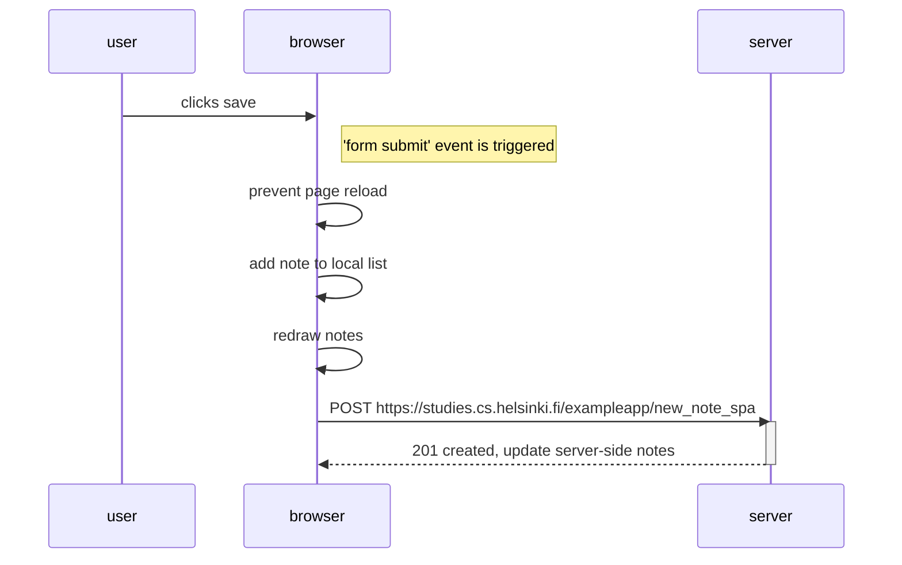

```mermaid
sequenceDiagram
    participant user
    participant browser
    participant server

    user ->> browser: clicks save
    
    Note right of browser: 'form submit' event is triggered
    browser ->> browser: prevent page reload
    browser ->> browser: add note to local list
    browser ->> browser: redraw notes

    browser->>server: POST https://studies.cs.helsinki.fi/exampleapp/new_note_spa
    activate server
    server-->>browser: 201 created, update server-side notes
    deactivate server
```