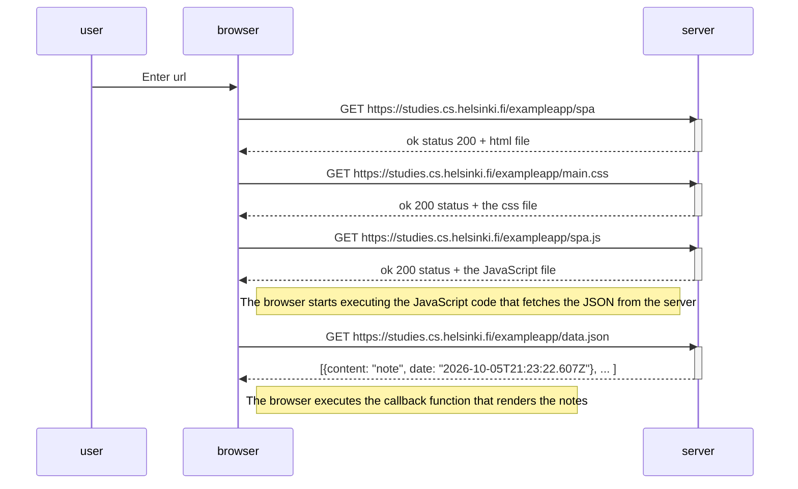

```mermaid
sequenceDiagram
    participant user
    participant browser
    participant server

    user ->> browser: Enter url
    
    browser->>server: GET https://studies.cs.helsinki.fi/exampleapp/spa
    activate server
    server-->>browser: ok status 200 + html file
    deactivate server

    browser->>server: GET https://studies.cs.helsinki.fi/exampleapp/main.css
    activate server
    server-->>browser: ok 200 status + the css file
    deactivate server

    browser->>server: GET https://studies.cs.helsinki.fi/exampleapp/spa.js
    activate server
    server-->>browser: ok 200 status + the JavaScript file
    deactivate server

    Note right of browser: The browser starts executing the JavaScript code that fetches the JSON from the server

    browser->>server: GET https://studies.cs.helsinki.fi/exampleapp/data.json
    activate server
    server-->>browser: [{content: "note", date: "2026-10-05T21:23:22.607Z"}, ... ]
    deactivate server

    Note right of browser: The browser executes the callback function that renders the notes
```